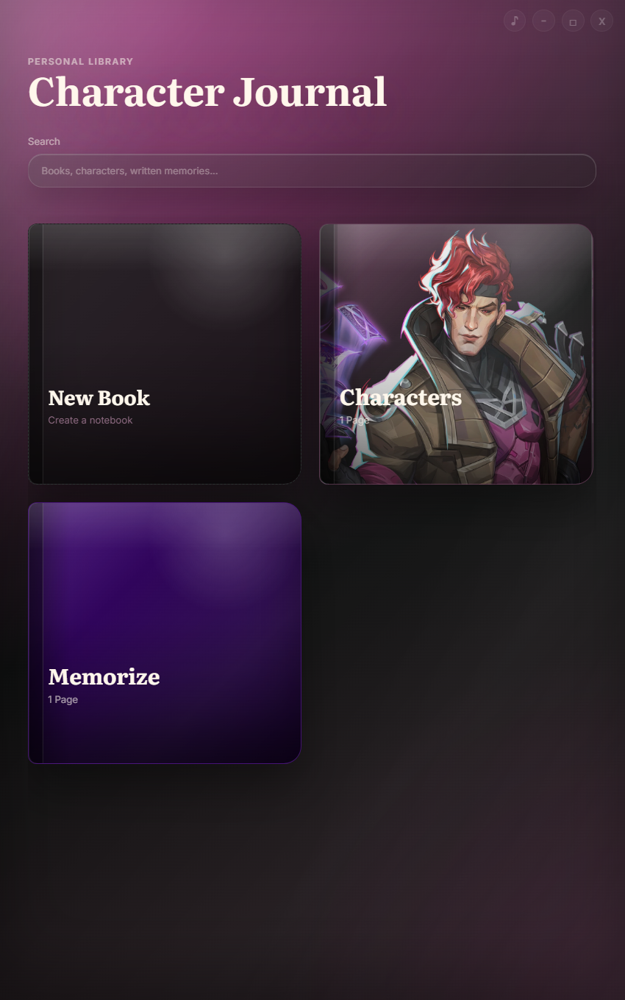
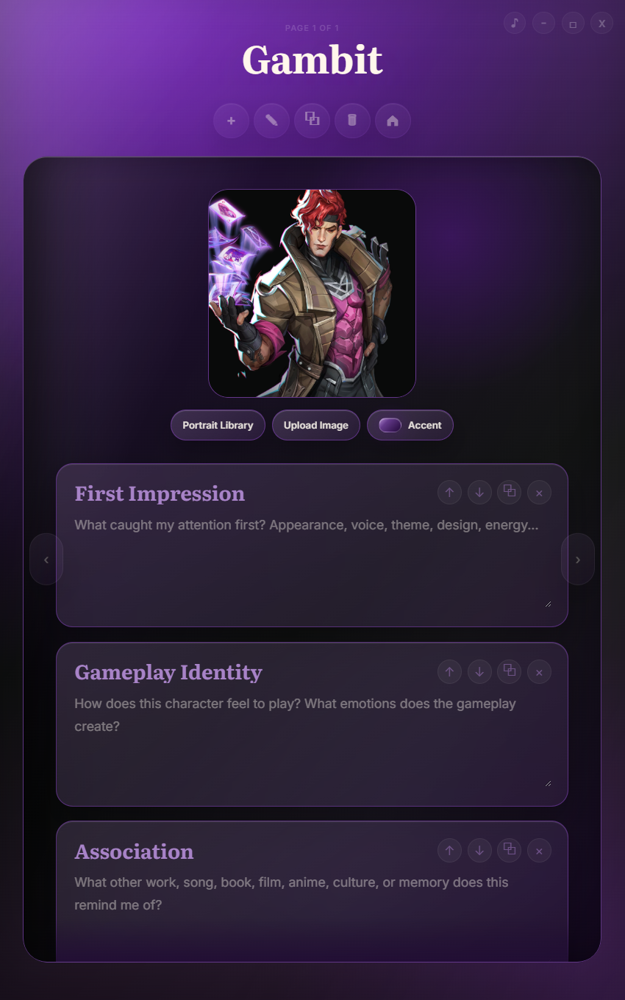
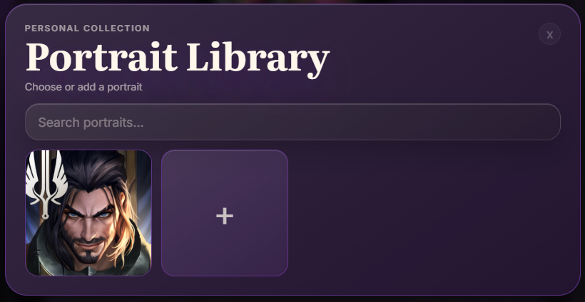

# Character Journal ⭐

# Character Journal

> **Collect characters. Capture inspiration. Never lose an idea again.**

Character Journal is a visual notebook designed for artists, writers, gamers and dreamers.

Instead of simply saving images, it helps you answer questions like:

- What caught my attention?
- Why do I love this design?
- What emotions does this character create?
- What does it remind me of?
- How can this inspire my own work?

Every page becomes a snapshot of your inspiration.

---

# ✨ Features

- 🎨 Automatic theme generation from portraits
- 📚 Beautiful notebook interface
- 🖼 Personal portrait library
- 🌈 Dynamic colors generated from every portrait
- 🎵 Optional UI sounds
- 📝 Structured inspiration pages
- 💾 Offline & local-first
- 🖱 Smooth desktop experience

---

# 📸 Screenshots

<h2 align="center">✨ Preview</h2>

  
  

  

---

# ❤️ Why I made this

I noticed that every time I fell in love with a fictional character, I forgot *why* a few months later.

I wanted a place where inspiration could be preserved—not just the image itself, but the thoughts, emotions, and memories attached to it.

Character Journal was created to become that place.

---

# 🚀 Download

Download the latest version from the **Releases** page.

---

# 🛣 Roadmap

## Version 1.0

- ✅ Character books
- ✅ Dynamic themes
- ✅ Portrait library
- ✅ UI sounds
- ✅ Local storage

## Future

- ⏳ Export to PDF
- ⏳ Markdown support
- ⏳ Character relationships
- ⏳ Tags & categories
- ⏳ Mobile version

---

Made with ❤️ by Muz.
